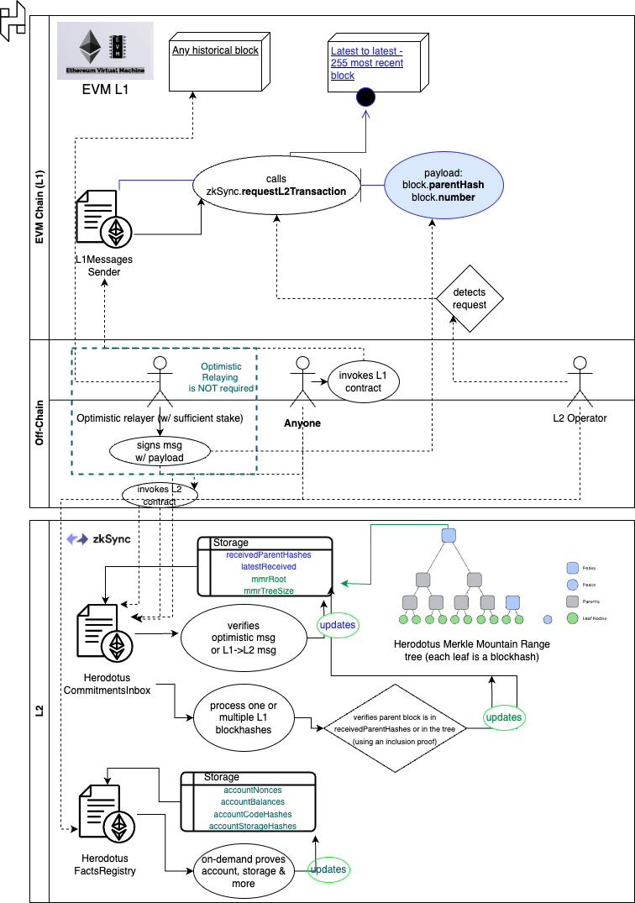

### herodotus-evm

Herodotus contracts for EVM chains.

## Overview



# Prerequisites:

- Git

- Node.js (^18.0)

- Yarn

- Foundry

- Solc

## Supported Chains

| Chain            | Status              |
| ---------------- | ------------------- |
| zkSync Testnet   | Supported           |
| zkSync Mainnet   | Support coming soon |
| Optimism Testnet | Support coming soon |

## Running Locally

Create a `.env` file based on `.env.example`, and then run:

```bash
git clone git@github.com:HerodotusDev/herodotus-evm.git
cd herodotus-evm
yarn install

forge install
forge test
```

## Contracts Overview

- CommitmentsInbox: receives block commitments from the origin chain using either the native messaging system or an optimistic relayer.

- HeadersProcessor: processes block headers from the origin chain and store them in a Merkle Mountain Range tree where the accumulation happens on-chain.

- FactsRegistry: stores facts (e.g., nonces, balances, code hashes, storage hashes etc.) for each proven origin chain account.

Note: currently, the origin chain is Ethereum L1 (Goërli on testnet and Mainnet on mainnet).
However, the contracts are designed to be chain-agnostic and can be used with any EVM-compatible chain.

## Deployed Contracts

- [Deployed Contracts Addresses](https://docs.herodotus.dev/herodotus-docs/deployed-contracts)

## Deployment

`source .env; forge script script/<ScriptName>.s.sol:<ScriptName> --rpc-url $ALCHEMY_URL --broadcast --private-key $PRIVATE_KEY --verify --etherscan-api-key $ETHERSCAN_API_KEY`

## Documentation

Here are some useful links for further reading:

- [Herodotus Documentation](https://docs.herodotus.dev)
- [Herodotus Builder Guide](https://herodotus.notion.site/herodotus/Herodotus-Hands-On-Builder-Guide-5298b607069f4bcfba9513aa75ee74d4)

## License

Copyright 2023 - Herodotus Dev
